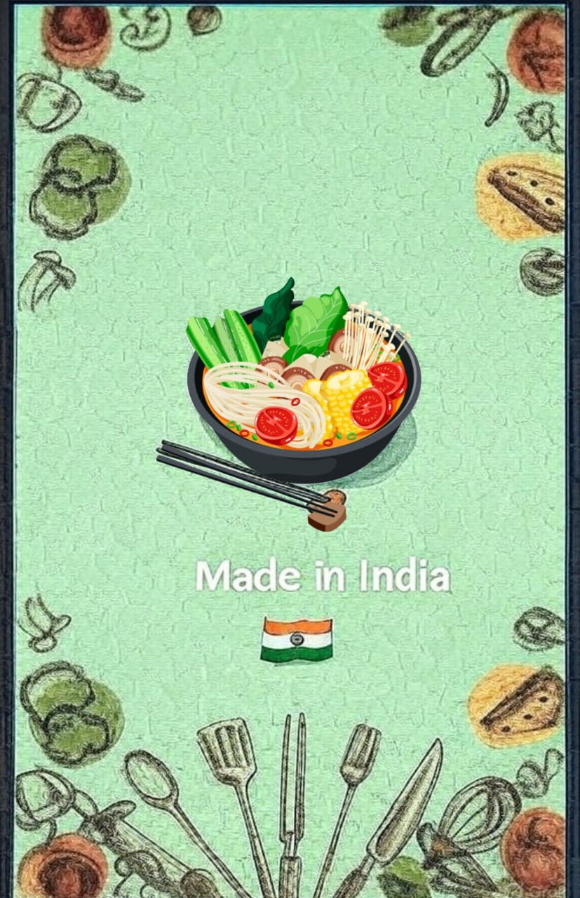

# Food Ordering App

## Overview
This is an Android application developed using Kotlin, designed to allow users to order food from a variety of international cuisines (e.g., Indian, Chinese, Italian). The app includes features like user authentication, order confirmation, payment processing, and a visually appealing interface with splash screens and restaurant images.

## Features
- User registration and login functionality.
- Forgot password recovery option.
- Home screen to browse available cuisines and restaurants.
- Order confirmation and payment details management.
- Splash screen for a smooth app launch.

## Technologies Used
- **Language**: Kotlin
- **Framework**: Android SDK with Jetpack Compose (assumed based on modern Android development).
- **Backend**: Firebase (assumed for authentication and possibly payment).
- **IDE**: Android Studio

## Installation/Setup
1. Install Android Studio on your computer.
2. Clone or download this repository: `git clone https://github.com/ShubhiV13/Food-Ordering-App.git` (or download the ZIP).
3. Open the project in Android Studio.
4. Set up Firebase (add `google-services.json` from Firebase Console if used).
5. Build and run the app on an emulator or physical device.

## Files
- `ConfirmOrderActivity.kt`: Handles the order confirmation process.
- `ForgotPasswordActivity.kt`: Manages password recovery for users.
- `HomeActivity.kt`: Displays the main screen with cuisine options.
- `LoginActivity.kt`: Manages user login functionality.
- `MainActivity.kt`: The entry point of the application.
- `PaymentDetailsActivity.kt`: Handles payment information and processing.
- `SignUpActivity.kt`: Manages user registration.
- `rest1.png` to `rest5.png`: Images of restaurants for the UI.
- `splashscreen.png`: Splash screen image for app launch.

## Screenshots
  
  
  
  
  
  

*Note: These screenshots enhance the visual appeal and demonstrate the app's interface.* 

## Future Improvements
- Add a cart management system with real-time updates.
- Integrate payment gateways (e.g., Stripe, PayPal) for actual transactions.
- Include user reviews and ratings for restaurants.
- Optimize performance for larger datasets.

## Contact
- **Author**: Shubhangi Vishwakarma
- **GitHub**: [ShubhiV13](https://github.com/ShubhiV13)
- **Email**: [vishwakarmashubhangi75@gmail.com]

## License
This project is open-source under the MIT License.
